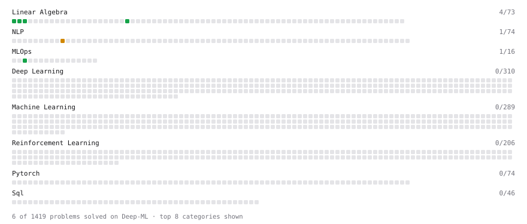

# Deep-ML

My machine learning practice from [Deep-ML](https://www.deep-ml.com). Every solution here was written by hand.

**30** solved · 30 problems · 0 labs · 0 math

[**Browse the interactive portfolio**](https://SUSH9391.github.io/deep-ml/) to replay this filling in over time.

## Problems

| | Difficulty | Solved | |
| --- | --- | --- | --- |
| [Calculate 2x2 Matrix Inverse](https://www.deep-ml.com/problems/8) | easy | 2026-08-22 | [solution](problems/0008-calculate-2x2-matrix-inverse) |
| [Calculate Batch Prediction Health Metrics](https://www.deep-ml.com/problems/249) | easy | 2026-08-20 | [solution](problems/0249-calculate-batch-prediction-health-metrics) |
| [Calculate Cosine Similarity Between Vectors](https://www.deep-ml.com/problems/76) | easy | 2026-08-22 | [solution](problems/0076-calculate-cosine-similarity-between-vectors) |
| [Calculate Covariance Matrix](https://www.deep-ml.com/problems/10) | easy | 2026-08-22 | [solution](problems/0010-calculate-covariance-matrix) |
| [Calculate Mean by Row or Column](https://www.deep-ml.com/problems/4) | easy | 2026-08-22 | [solution](problems/0004-calculate-mean-by-row-or-column) |
| [Construct Causal Attention Mask via tril and triu Methods](https://www.deep-ml.com/problems/965) | easy | 2026-08-27 | [solution](problems/0965-construct-causal-attention-mask-via-tril-and-triu-methods) |
| [Dot Product Calculator](https://www.deep-ml.com/problems/83) | easy | 2026-08-22 | [solution](problems/0083-dot-product-calculator) |
| [Implement Compressed Row Sparse Matrix (CSR) Format Conversion](https://www.deep-ml.com/problems/65) | easy | 2026-08-13 | [solution](problems/0065-implement-compressed-row-sparse-matrix-csr-format-conversion) |
| [Implement Global Average Pooling](https://www.deep-ml.com/problems/114) | easy | 2026-09-08 | [solution](problems/0114-implement-global-average-pooling) |
| [Implement the ELU Activation Function](https://www.deep-ml.com/problems/97) | easy | 2026-08-22 | [solution](problems/0097-implement-the-elu-activation-function) |
| [Matrix-Vector Dot Product](https://www.deep-ml.com/problems/1) | easy | 2026-08-13 | [solution](problems/0001-matrix-vector-dot-product) |
| [Per-Token Decode Latency from Memory Bandwidth](https://www.deep-ml.com/problems/1214) | easy | 2026-08-21 | [solution](problems/1214-per-token-decode-latency-from-memory-bandwidth) |
| [Poisson Distribution Probability Calculator](https://www.deep-ml.com/problems/81) | easy | 2026-08-22 | [solution](problems/0081-poisson-distribution-probability-calculator) |
| [Reshape Matrix](https://www.deep-ml.com/problems/3) | easy | 2026-08-19 | [solution](problems/0003-reshape-matrix) |
| [Scalar Multiplication of a Matrix](https://www.deep-ml.com/problems/5) | easy | 2026-08-22 | [solution](problems/0005-scalar-multiplication-of-a-matrix) |
| [Transpose of a Matrix](https://www.deep-ml.com/problems/2) | easy | 2026-08-18 | [solution](problems/0002-transpose-of-a-matrix) |
| [Binomial Distribution Probability](https://www.deep-ml.com/problems/79) | medium | 2026-08-22 | [solution](problems/0079-binomial-distribution-probability) |
| [Bradley-Terry Model for Pairwise Rankings](https://www.deep-ml.com/problems/322) | medium | 2026-08-14 | [solution](problems/0322-bradley-terry-model-for-pairwise-rankings) |
| [Calculate Eigenvalues of a Matrix](https://www.deep-ml.com/problems/6) | medium | 2026-08-22 | [solution](problems/0006-calculate-eigenvalues-of-a-matrix) |
| [Data-Efficient Action Mapping with Few Labeled Expert Samples](https://www.deep-ml.com/problems/728) | medium | 2026-08-31 | [solution](problems/0728-data-efficient-action-mapping-with-few-labeled-expert-samples) |
| [Implement BatchNorm2d from Scratch (training mode)](https://www.deep-ml.com/problems/902) | medium | 2026-09-07 | [solution](problems/0902-implement-batchnorm2d-from-scratch-training-mode) |
| [Implement Layer Normalization for Sequence Data](https://www.deep-ml.com/problems/109) | medium | 2026-08-23 | [solution](problems/0109-implement-layer-normalization-for-sequence-data) |
| [Implement Masked Self-Attention](https://www.deep-ml.com/problems/107) | medium | 2026-08-24 | [solution](problems/0107-implement-masked-self-attention) |
| [Implement Self-Attention Mechanism](https://www.deep-ml.com/problems/53) | medium | 2026-08-23 | [solution](problems/0053-implement-self-attention-mechanism) |
| [Matrix times Matrix ](https://www.deep-ml.com/problems/9) | medium | 2026-08-22 | [solution](problems/0009-matrix-times-matrix) |
| [Negative Binomial Distribution Probability](https://www.deep-ml.com/problems/247) | medium | 2026-08-28 | [solution](problems/0247-negative-binomial-distribution-probability) |
| [Normal Distribution PDF Calculator](https://www.deep-ml.com/problems/80) | medium | 2026-08-22 | [solution](problems/0080-normal-distribution-pdf-calculator) |
| [Numerically Stable Cross-Entropy](https://www.deep-ml.com/problems/914) | medium | 2026-08-29 | [solution](problems/0914-numerically-stable-cross-entropy) |
| [Temperature Decay Scheduler](https://www.deep-ml.com/problems/231) | medium | 2026-08-26 | [solution](problems/0231-temperature-decay-scheduler) |
| [Implement Multi-Head Attention](https://www.deep-ml.com/problems/94) | hard | 2026-08-24 | [solution](problems/0094-implement-multi-head-attention) |

---

_This file is regenerated by Deep-ML on every push._
